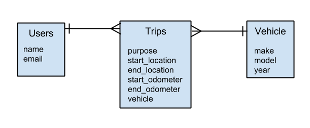

 ##MILEAGEMATE APP
##SOFTWARE DESIGN AND TECHNICAL THOUGHTS
##BY
##GERALD WOLFE

###Introduction
The app would allow the user to have the following interactions:
1. record a trip
2. describe a purpose
3. create/select a vehicle
4. record start and end location and odometer

###Initial Architecture

The first thing I would do is create an initial ERD to visualize the data structure and the relationships between the objects.

Two initial questions come to mind as I work through this initial ERD.
1.  Should a user have many vehicles or should a user have many vehicles only through Trips?
2.  Am I missing any other necessary attributes in order to meet the specs?

If this ERD provides a good foundation for our data, then I would want to wire frame a simple UI/UX so that I have an understanding of the UI/UX logic flow.  The UI/UX was not discussed in the requirements.  Because it was not discussed, it leaves room for too much interpretation.  Interpretation leads to higher costs, unmet expectations and frustration.  In developing this app, I would ask a number of UI/UX questions some of which I will describe below.

Also, once I have this information, I would draft up a set of user stories… maybe 10 - 15 to start and confirm and order the user stories.

###Programmatic Features
Since NodeJS is the back end of choice, MongoDB fits well with its JSON format.   It allows for there to be a JavaScript front and back end code stack using JSON data stores.

The programmatic requirements seem to be straightforward.

MileageMate needs a “confirmation” function.  A confirmation button would control a confirmation event which when triggered calls certain programmatic functions to store data and create a new trip.  This seems straightforward at this time.  There are some initial questions though.

Can the user change values after “confirming”?
If so, should there a time limit to changing values?
Do we want to store that the user has changed values?

MileageMate needs to store the 20 most recent trips.  Storing the 20 most recent trips in local storage on the device is a critical functional piece.  With HTML5’s Web Storage, BackboneJS’s save function and Cordova’s ability to access a device’s local storage would be the tools I would use.  I have another question.

Do the 20 most recent trips include the changes the user may have made (assuming changes are allowed)?

MileageMate also needs to generate a monthly report.  This functionality is straight up good old fashioned programming -- grab the data, manipulate it and deliver it.

How is the data to be delivered e.g. excel sheet, on screen within the app itself, pdf, all three, etc.?
How should the data delivery look?
Is the monthly report to be timecoded and stamped and independently saved?
Where is it to be saved?  In what form?
Who has access to it?

These are some of the questions that immediately come to mind.

There is another very important issue to resolve though.  Cost.

Creating user stories as a preliminary matter will help manage costs.  I would highly recommend creating user stories for MileageMate.

Also, Using JavaScript as the arterial stack, so to speak, would help keep development costs low, because BackboneJS, NodeJS and MongoDB together work efficiently together.

But, I do have some thoughts on the database.

###Database as a Programmatic Aspect

The choice of data storage and retrieval can be a complicated one.  Here, MongoDB is the chosen data storage technology.  On an initial glance without knowing more about the UI/UX, and the user interaction with the data, using Mongo should not create any unnecessary burdens.  One of the first attributes I look for when choosing a database system is based on whether the app places a high value priority on the use of ‘joins’ or other similar tabular retrievals.  If so, then a discussion regarding a relational database structure is in order.

On a quick analysis here, using a traditional relational DB model such as PostgreSQL may have some benefits in that a monthly trip report which aggregates multiple attributes from multiple trips is seemingly a crucial and foundational part of MileageMate.  Calculations are more native to relational database models than document stores such as MongoDB.

MongoDB is great for self contained documents.  As one starts to reference other documents, the waters become cloudy.  But for now, MongoDB will certainly work, plus it has the benefit of already holding objects in a JSON format.

On the other hand, PostgreSQL hstore handles key value pairs exceptionally well.  In any case, these issues are good fodder for a database design discussion.

###User Interaction

The requirements ask for MileageMate to run on multiple devices.  The clear import though is to ensure it works on mobile devices.  The UI/UX and functionality needs to have a strong focus on mobile.

The UI should be able to distinguish between what devices are being used.  Mobile requires speed and efficient memory usage.  Mobile users are more forgiving on an app’s initial startup than they are of waiting for responses from their app once they are logged in.  MongoDB allows the data store to be essentially stored in one big document contained in the device’s local storage which can be retrieved upon application load.   This is fast data retrieval.

MongoDB also allows for easy trip creation offline since the data is handled on the client side.

###Technical Requirements

Creating trips offline will be somewhat academic since trips will be created client side using BackboneJS collections and model instances.

Ensuring trip confirmation can be handled by validating that certain fields have certain data or types of data.  Not until all fields have been properly validated and return true will the confirmation button and confirmation event be activated.

In order to ensure proper and seamless UI irrespective of each device, the code will need to ensure that its HTTP requests for the user-agent header also includes the device data.  The HTML and CSS would then need to account for responsive rendering.  This can be done through the media queries for screen size.  Using a CSS grid and styling system like Bootstrap, Foundation, or Skeleton should be considered.  I’ve used all three and if all one needs is a simple grid system, skeleton should be sufficient.

Technical Platform
My approach is typically to find the tools that handle the current business problem and user stories as well as immediate future user stories.  The tools as proposed would seem to be appropriate for this app with the caveats as described above.

jQuery (through jQuery mobile) has been shown to work well with mobile devices.   BackBoneJS uses jQuery as a dependency.  So, the fit is good.

Using NodeJS to handle client server communication works.   NodeJS is a tool that really does well with real-time non-blocking client to server communications.  I think the real value in using NodeJS is having the integrated JavaScript stack available because MileageMate is real-time dependent.

##Key Technical Challenge
###Multi-Device

To make MileageMate multi-device capable, we need to emulate native apps on the Apple and Android platform.  Cordova creates a hybrid wrapper.

Since Cordova embeds the browser within the device’s window, the UI framework is really just the browser.  Since the browser natively reads and compiles JS, using BackboneJS, NodeJS and MongoDB together have significant merit along with a responsive grid system.

Cordova’s API is that it includes a localStorage object which interacts with the device’s local storage.

Another benefit for using MongoDB is that localStorage saves data in key value pairs.  Yes, PostrgreSQL through hstore can do that but that would involve more programmatic work and thus increase the cost, potential bugs, and delivery time.

###Syncing

Using NodeJS provides a native way to implement syncing.   We create a server listening event.  When MileageMate is online, it emits a request to the server and the server responds with a syncing function.  The syncing function would not be called until all the appropriate data entry validations return true.

The key functionality of localStorage is that it is specifically meant to allow users to interact with data both online and offline.  RESTful requests can be made to localStorage instead of the server if the server is not available just by re-routing or overriding the BackboneJS save function.  By doing this, MileageMate can essentially be a 100% client-side application.  BackboneJS is well suited to interact with a server as well.  Using BackboneJS’s built in sync function for models allows us to persist the data to the server.  Adding a sync function to a Backbone collection would be the path of choice.

So, the bottom line is that upon confirmation of a trip, the save function is called and the sync function is called.

###OTHER AREAS OF CONTENTION

I’ve already pointed out the UI/UX issues above which must be resolved.  But there is another issue.

Since MileageMate essentially runs on a mobile device we may want to decide whether the user should be able to actually enter the hard data or, instead, scroll through a list of data items.

We would need details on the most popular devices expected to be used to ensure proper functionality and testing.

Since Cordova’s API provides the access to the mobile device’s capabilities including GPS coordinates, a high value feature I would like to see implemented is comparing the distance traveled from the user with the automated GPS distance.  This user story is very likely a compelling functional aspect to MileageMate as well as a way to create greater revenue generation.

Thank you for letting me share my initial thoughts.

_Note: I prepared this document without the benefit of collaboration.  I am a firm believer in collaborative problem solving.  This document should be taken as a starting point, and as a first draft.  It does, however, depict how I would think through this problem._
